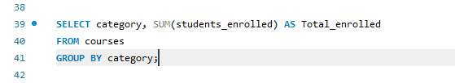
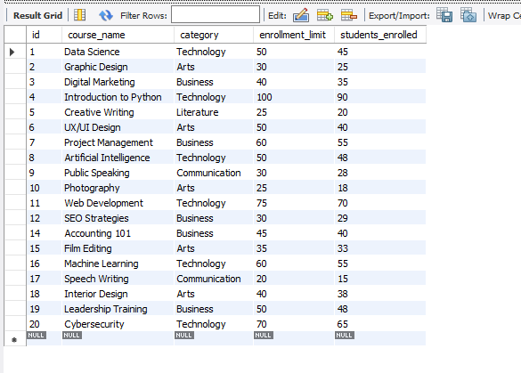
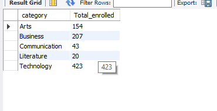
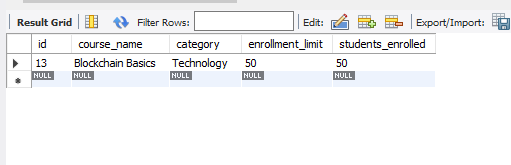
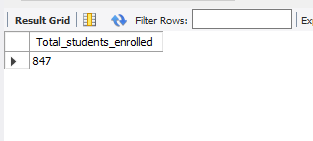
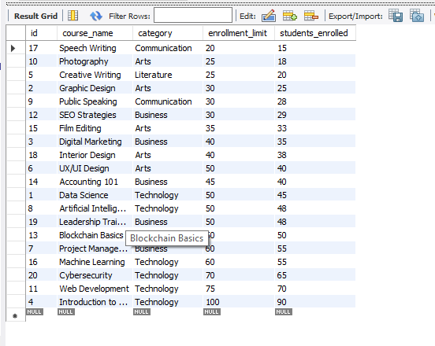

# Final Task 3-1 Using MYSQL CLAUSE

## Step byu step
Task 1: Retrieve all courses where students_enrolled is less than the enrollment_limit.

Task 2: Group courses by category and calculate the total number of students enrolled for each category.

Task 3: Retrieve the courses that are fully enrolled (i.e., students_enrolled equals enrollment limit).

Task 4: Calculate the total number of students enrolled across all courses.

Task 5: Sort courses by students enrolled in ascending order.

## Here's the screenshots
### Task 1 Statement

### Task 2 Statement

### Task 3 Statement

### Task 4 Statement

### Task % Statement

### Task 1 Qeury

### Task 2 Query

### Task 3 Query

### Task 4 Query

### Task 5 Query

